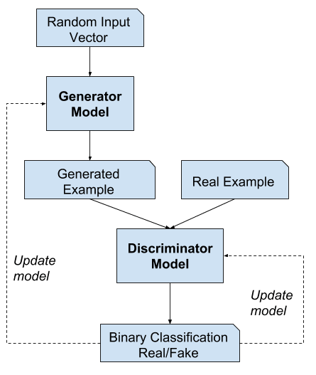

# 4-GANs-Implementations

Human Faces
https://colab.research.google.com/drive/18fLFoxI56ETCbLIDJKWTwTdvKfihKVnt?usp=sharing

MNIST
https://colab.research.google.com/drive/1s-Nc5RwPNyd9enJ52TmucFZcuIzads8P?usp=sharing

ART
https://colab.research.google.com/drive/1uUDzAK6St4_AZFu_uBVXQjxefGhNa8f4?usp=sharing

Anime Faces
https://colab.research.google.com/drive/1xFWyerR7-49Z-6lncSLfw_JJU8VUzhh5?usp=sharing


Let's load this dataset using the ImageFolder class from torchvision. We will also resize and crop the images to 64x64 px, and normalize the pixel values with a mean & standard deviation of 0.5 for each channel. This will ensure that pixel values are in the range (-1, 1), which is more convenient for training the discriminator. We will also create a data loader to load the data in batches.


The dataset has a single folder called images which contains all 63,000+ images in JPG format.


# 4-GANs-Implementations

Using the Prestained Mobilenet V2 model and OpenCV we detect human images wearing a mask or not along with Probability.

<p align="center">
   
</p>

---

### Table of Contents

- [Description](#description)
- [Results](#results)
- [Project Layout](#project-layout)
- [References](#references)
- [Author Info](#author-info)

---

## Description

<br>
Deep neural networks are used mainly for supervised learning: classification or regression. Generative Adversarial Networks or GANs, however, use neural networks for a very different purpose: Generative modeling
There are two neural networks: a Generator and a Discriminator. The generator generates a "fake" sample given a random vector/matrix, and the discriminator attempts to detect whether a given sample is "real" (picked from the training data) or "fake" (generated by the generator). Training happens in tandem: we train the discriminator for a few epochs, then train the generator for a few epochs, and repeat. This way both the generator and the discriminator get better at doing their jobs.

GANs however, can be notoriously difficult to train, and are extremely sensitive to hyperparameters, activation functions and regularization. In this tutorial, we'll train a GAN to generate images of anime characters' faces.


<br>

### Built With

- PyTorch
- Matplotlib

### For Execution

The easiest way to start executing the code is to click the Run button at the top of this page and select Run on Colab. Google Colab is a free online platform for running Jupyter notebooks using Google's cloud infrastructure. You can also select "Run on Binder" or "Run on Kaggle" if you face issues running the notebook on Google Colab. 

To run the code on your computer locally, you'll need to set up Python, download the notebook and install the required libraries. We recommend using the Conda distribution of Python. Click the Run button at the top of this page, select the Run Locally option, and follow the instructions.
<br>

---

## Results

  <br/>

### Anime Faces Generation 

<p align="center">
   
</p>

<p align="center">
  <video autoplay loop src="Anime Faces Generation - animefacedataset\Training Video.avi" > </video>
</p>

[](https://youtu.be/vt5fpE0bzSY)


#### [Back To The Top](#4-GANs-Implementations)

---

## Project Layout

```
4-GANs-Implementations
├─ Face_Mask_Detection.ipynb
├─ Final Image.png
├─ Images
│  ├─ Only_Mask.jpg
│  ├─ Sol_Mask.png
│  ├─ Sol_No_Mask.png
│  ├─ Sol_Only_Mask.png
│  ├─ Without_Mask.jpg
│  └─ With_Mask.jpg
└─ README.md

```

---

## References

- [PyTorch](https://pytorch.org/)
- [Matplotlib](https://matplotlib.org/)

---

## Author Info

- LinkedIn - [Srinivas K](https://www.linkedin.com/in/srinivas-konduri/)
- Github - [Srinivas K](https://github.com/srinivaskool)

#### [Back To The Top](#4-GANs-Implementations)


